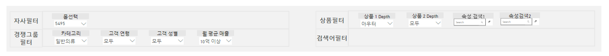
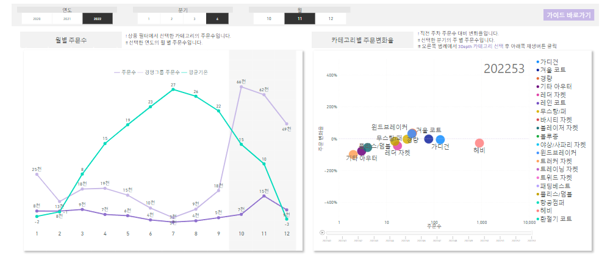
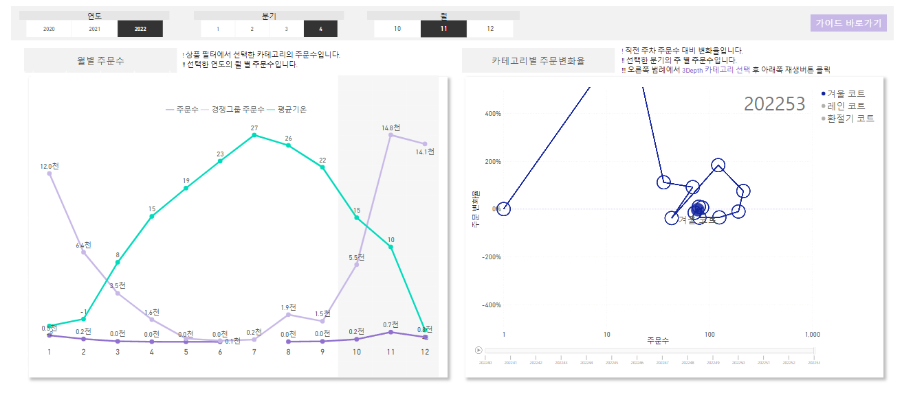
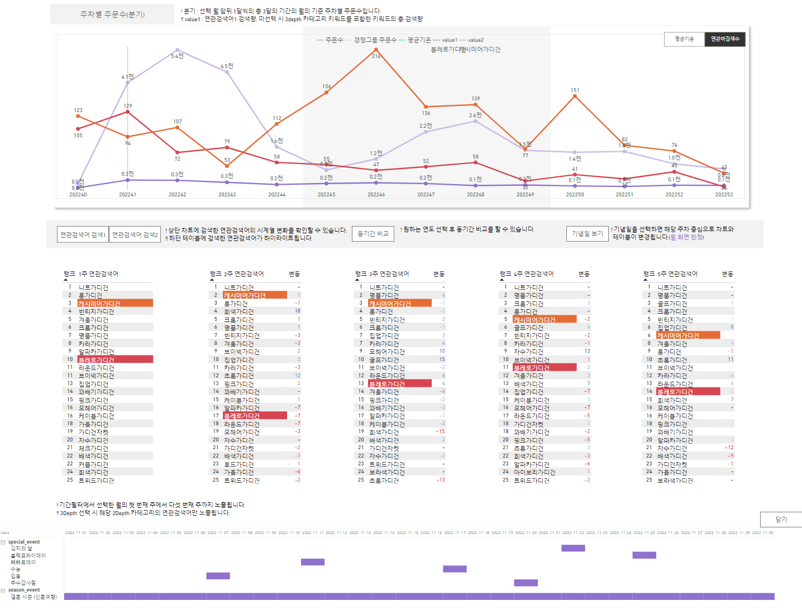
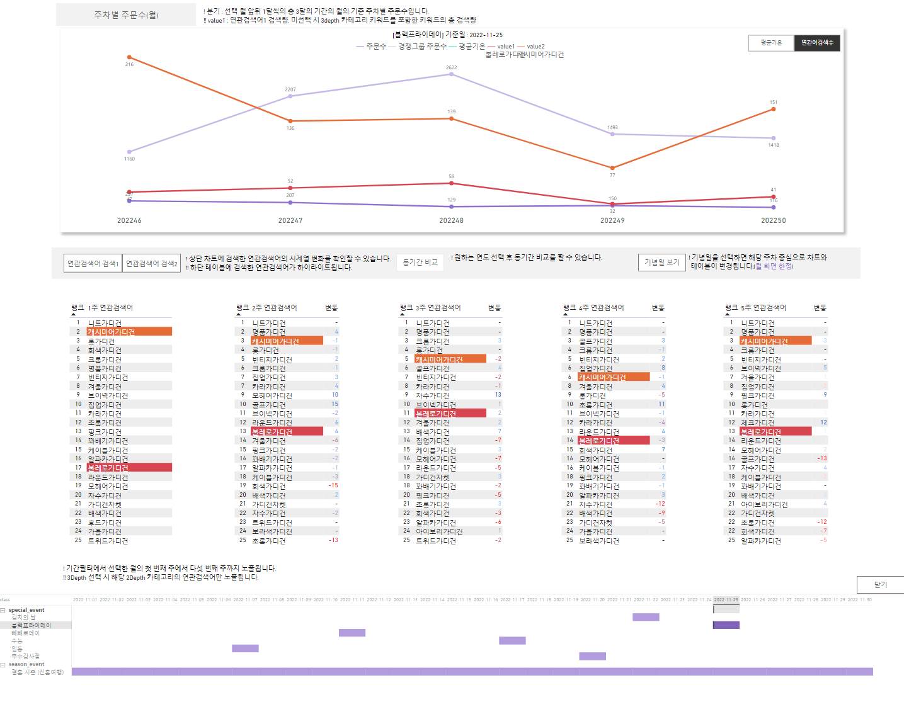
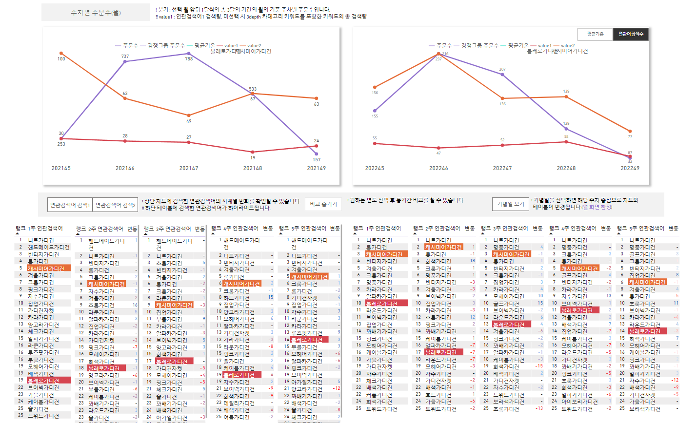
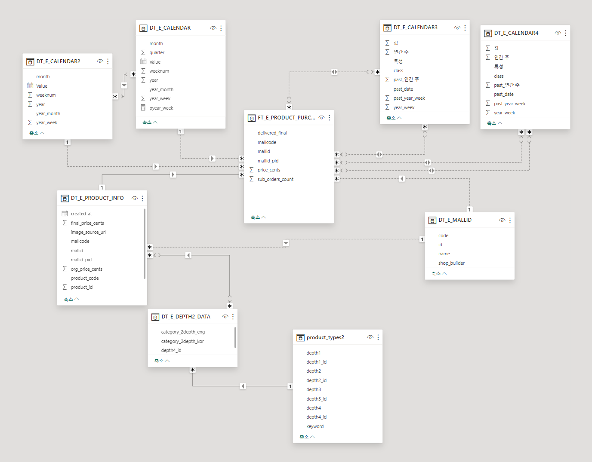
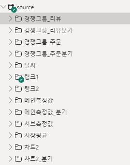
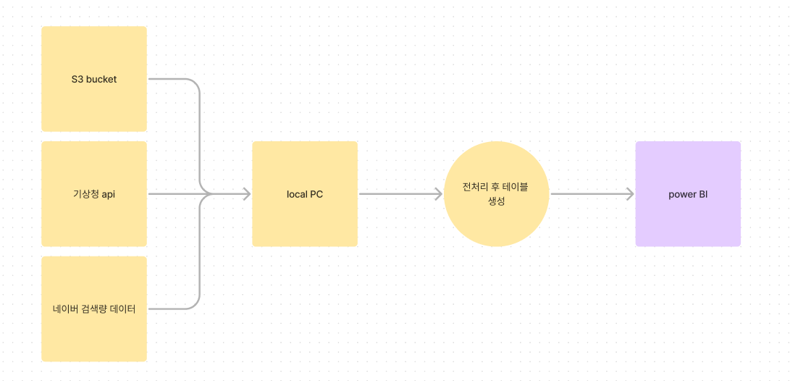

# 프로젝트 목적
패션 온라인 몰의 상품 카테고리별 주문수에 영향을 끼치는 요소와 경쟁사의 판매 동향을 파악하기 위한 대시보드를 제작

# 대시보드 제작 과정
1. 정의
	목적 정의
	지표 정의
	데이터 정의
2. 데이터
	데이터 수집
	데이터 전처리
3. 대시보드 기획
4. 데이터셋 생성
5. 대시보드 생성
6. 데이터 셋 파이프라인 생성

# 대시보드 구성

### 필터
  
자사필터 : 고객사 별 고정 값
상품필터 : 카테고리 분류별
경쟁그룹 필터 : 카테고리별, 주고객 층, 월 평균 매출 설정

### 월별 주문수 & 주문 변화율
  
월별 주문수 : 경쟁사 주문수와 비교하여 우위 열위인 시기를 확인하고, 기온과의 상관관계 파악

  
주문 변화율 : 시기가 변화함에 따라 주문량이 얼마나 변화하는 지 시각 적으로 파악하여 변화량이 큰 시기 파악

### 주차별 주문수 & 연관검색어
  
주차별 주문수 : 경쟁사 주문수와 비교하여 우위 열위인 시기를 확인하고, 검색어 or 기온과 주문수와의 상관관계 파악

  
기념일 보기 : 특정 기념일 기준으로 전후 주문수 파악

  
동기간 비교 : 작년 동기간 검색량과 주문수의 변화 파악

# 데이터 셋 구성

  
전년대비 데이터를 표기하기 위해 캘린더를 2개씩 생성
크로스필터로 인한 속도 저하가 발생

# 주요 지표
  

검색순위
~~~python
랭크1주 =   
  
var value1=  
switch(true(),  
right([lookupval],2)="01" ,  
CALCULATE(max('DT_E_CALENDAR'[year_week])+1,filter(all('DT_E_CALENDAR'),'DT_E_CALENDAR'[year] = SELECTEDVALUE('DT_E_CALENDAR'[year])-1)),  
right([lookupval],2)="02" ,  
CALCULATE(max('DT_E_CALENDAR'[year_week])+2,filter(all('DT_E_CALENDAR'),'DT_E_CALENDAR'[year] = SELECTEDVALUE('DT_E_CALENDAR'[year])-1)),  
[lookupval]  
)  
  
return  
  
if(isfiltered(DT_E_CALENDAR[Value]),  
  
    if( ISFILTERED(product_types2[depth4]),  
        rankx(  
        ALLSELECTED(FT_E_RELATED_KEYWORD[related_keyword]),  
        CALCULATE(sum(FT_E_RELATED_KEYWORD[values]),  
        filter(all(DT_E_RELATED_KEYWORD_LEGEND2),selectedvalue(product_types2[depth3])=DT_E_RELATED_KEYWORD_LEGEND2[depth2]),  
        USERELATIONSHIP(DT_E_RELATED_KEYWORD_LEGEND2[related_keyword],FT_E_RELATED_KEYWORD[related_keyword]),  
        USERELATIONSHIP('DT_E_CALENDAR3'[past_year_week],FT_E_RELATED_KEYWORD[year_week]),  
        filter(DT_E_CALENDAR3,DT_E_CALENDAR3[값] = (value1-2)),  
        KEEPFILTERS ( 'DT_E_CALENDAR3'[특성] = "year_week" && selectedvalue(DT_E_CALENDAR[Value]) = DT_E_CALENDAR3[class] )  
        ),,,Skip),  
        rankx(ALLSELECTED(FT_E_RELATED_KEYWORD[related_keyword]),  
        CALCULATE(sum(FT_E_RELATED_KEYWORD[values]),  
        USERELATIONSHIP('DT_E_CALENDAR3'[past_year_week],FT_E_RELATED_KEYWORD[year_week]),  
        filter(DT_E_CALENDAR3,DT_E_CALENDAR3[값] = (value1-2)),  
        KEEPFILTERS ( 'DT_E_CALENDAR3'[특성] = "year_week" && selectedvalue(DT_E_CALENDAR[Value]) = DT_E_CALENDAR3[class] )  
        ),,,Skip)  
    ),  
  
    if( ISFILTERED(product_types2[depth4]),  
    rankx(  
    ALLSELECTED(FT_E_RELATED_KEYWORD[related_keyword]),  
    CALCULATE(sum(FT_E_RELATED_KEYWORD[values]),  
    filter(all(DT_E_RELATED_KEYWORD_LEGEND2),selectedvalue(product_types2[depth3])=DT_E_RELATED_KEYWORD_LEGEND2[depth2]),  
    USERELATIONSHIP(DT_E_RELATED_KEYWORD_LEGEND2[related_keyword],FT_E_RELATED_KEYWORD[related_keyword]),  
    USERELATIONSHIP('DT_E_CALENDAR'[year_week],FT_E_RELATED_KEYWORD[year_week]),  
    filter('DT_E_CALENDAR','DT_E_CALENDAR'[weeknum]=min('DT_E_CALENDAR'[weeknum])),  
    USERELATIONSHIP('DT_E_CALENDAR3'[year_week],FT_E_RELATED_KEYWORD[year_week]),  
    KEEPFILTERS ( 'DT_E_CALENDAR3'[특성] = "base_year_week" )  
    ),,,Skip  
    ),  
    rankx(ALLSELECTED(FT_E_RELATED_KEYWORD[related_keyword]),  
    CALCULATE(sum(FT_E_RELATED_KEYWORD[values]),  
    USERELATIONSHIP('DT_E_CALENDAR'[year_week],FT_E_RELATED_KEYWORD[year_week]),  
    filter('DT_E_CALENDAR','DT_E_CALENDAR'[weeknum]=min('DT_E_CALENDAR'[weeknum])),  
    USERELATIONSHIP('DT_E_CALENDAR3'[year_week],FT_E_RELATED_KEYWORD[year_week]),  
    KEEPFILTERS ( 'DT_E_CALENDAR3'[특성] = "base_year_week" )  
    ),,,Skip)  
    )  
)
~~~

검색량
차트에 5주로 표기되어 기준 주차 앞 뒤로 첫주 둘째주 마지막 주 등은 연도가 바뀜에 따라 다른 값을 출력해야함

~~~python

selected_keyword_base1 =   
var value1=  
  
switch(true(),  
    right([lookupval],2)="01" || right([lookupval],2)="02",  
    if(isfiltered(DT_E_CALENDAR[Value]),  
    calculate(sum(FT_E_RELATED_KEYWORD[values]),   
    USERELATIONSHIP(FT_E_RELATED_KEYWORD[related_keyword],DT_E_RELATED_KEYWORD_LEGEND1[related_keyword]),  
    USERELATIONSHIP('DT_E_CALENDAR3'[past_year_week],FT_E_RELATED_KEYWORD[year_week]),  
    filter(DT_E_CALENDAR3,DT_E_CALENDAR3[값] >= [lookupval_lastweek] && DT_E_CALENDAR3[값] < ([lookupval]+3)),  
    KEEPFILTERS ( 'DT_E_CALENDAR3'[특성] = "year_week" && selectedvalue(DT_E_CALENDAR[Value]) = DT_E_CALENDAR3[class] )  
    ),  
    calculate(sum(FT_E_RELATED_KEYWORD[values]),   
    USERELATIONSHIP(FT_E_RELATED_KEYWORD[related_keyword],DT_E_RELATED_KEYWORD_LEGEND1[related_keyword]),  
    USERELATIONSHIP(FT_E_RELATED_KEYWORD[year_week],'DT_E_CALENDAR'[year_week]),  
    USERELATIONSHIP('DT_E_CALENDAR3'[year_week],FT_E_RELATED_KEYWORD[year_week]),  
    KEEPFILTERS ( 'DT_E_CALENDAR3'[특성] = "base_year_week" )  
    )  
    ),  
    right([lookupval],2)="52" || right([lookupval],2)="53",  
      
    if(isfiltered(DT_E_CALENDAR[Value]),  
  
    calculate(sum(FT_E_RELATED_KEYWORD[values]),   
    USERELATIONSHIP(FT_E_RELATED_KEYWORD[related_keyword],DT_E_RELATED_KEYWORD_LEGEND1[related_keyword]),  
    USERELATIONSHIP('DT_E_CALENDAR3'[past_year_week],FT_E_RELATED_KEYWORD[year_week]),  
    filter(DT_E_CALENDAR3,DT_E_CALENDAR3[값] > ([lookupval]-3)  && DT_E_CALENDAR3[값] <= [lookupval_firstweek]),  
    KEEPFILTERS ( 'DT_E_CALENDAR3'[특성] = "year_week" && selectedvalue(DT_E_CALENDAR[Value]) = DT_E_CALENDAR3[class] )  
    ),  
    calculate(sum(FT_E_RELATED_KEYWORD[values]),   
    USERELATIONSHIP(FT_E_RELATED_KEYWORD[related_keyword],DT_E_RELATED_KEYWORD_LEGEND1[related_keyword]),  
    USERELATIONSHIP(FT_E_RELATED_KEYWORD[year_week],'DT_E_CALENDAR'[year_week]),  
    USERELATIONSHIP('DT_E_CALENDAR3'[year_week],FT_E_RELATED_KEYWORD[year_week]),  
    KEEPFILTERS ( 'DT_E_CALENDAR3'[특성] = "base_year_week" )  
    )  
    ),  
  
    if(isfiltered(DT_E_CALENDAR[Value]),  
    calculate(sum(FT_E_RELATED_KEYWORD[values]),   
    USERELATIONSHIP(FT_E_RELATED_KEYWORD[related_keyword],DT_E_RELATED_KEYWORD_LEGEND1[related_keyword]),  
    USERELATIONSHIP('DT_E_CALENDAR3'[past_year_week],FT_E_RELATED_KEYWORD[year_week]),  
    filter(DT_E_CALENDAR3,DT_E_CALENDAR3[값] > ([lookupval]-3) && DT_E_CALENDAR3[값] < ([lookupval]+3)),  
    KEEPFILTERS ( 'DT_E_CALENDAR3'[특성] = "year_week" && selectedvalue(DT_E_CALENDAR[Value]) = DT_E_CALENDAR3[class] )  
    ),  
    calculate(sum(FT_E_RELATED_KEYWORD[values]),   
    USERELATIONSHIP(FT_E_RELATED_KEYWORD[related_keyword],DT_E_RELATED_KEYWORD_LEGEND1[related_keyword]),  
    USERELATIONSHIP(FT_E_RELATED_KEYWORD[year_week],'DT_E_CALENDAR'[year_week]),  
    USERELATIONSHIP('DT_E_CALENDAR3'[year_week],FT_E_RELATED_KEYWORD[year_week]),  
    KEEPFILTERS ( 'DT_E_CALENDAR3'[특성] = "base_year_week" )  
    )  
    )  
)  
  
  
  
return  
  
if(ISFILTERED(DT_E_RELATED_KEYWORD_LEGEND1[related_keyword]),value1,blank())

~~~

달력 첫주
~~~python

lookupval_lastweek =

  

switch(true(),

right([lookupval],2)="01",

CALCULATE(max('DT_E_CALENDAR'[year_week])-1,filter(all('DT_E_CALENDAR'),'DT_E_CALENDAR'[year] = SELECTEDVALUE('DT_E_CALENDAR'[year])-1)),

right([lookupval],2)="02",

CALCULATE(max('DT_E_CALENDAR'[year_week]),filter(all('DT_E_CALENDAR'),'DT_E_CALENDAR'[year] = SELECTEDVALUE('DT_E_CALENDAR'[year])-1))

)

~~~

분기 주문수
~~~python
하이라이트1_90주문 =   
  
var month1=1  
var month2=12  
var month3={SELECTEDVALUE(DT_E_CALENDAR[month])+1}  
var month4={SELECTEDVALUE(DT_E_CALENDAR[month])-1}  
var month5={SELECTEDVALUE(DT_E_CALENDAR[month])+1,SELECTEDVALUE(DT_E_CALENDAR[month])-1}  
var list1 = SUMMARIZECOLUMNS(DT_E_CALENDAR2[year_week])  
var min_week =   
    CALCULATE(  
        min(DT_E_CALENDAR4[year_week]),  
        filter(DT_E_CALENDAR4,[year_week] in list1),  
        KEEPFILTERS ( 'DT_E_CALENDAR4'[특성] = "base_year_week" )  
    )  
var max_week =   
    CALCULATE(  
        max(DT_E_CALENDAR4[year_week]),  
        filter(DT_E_CALENDAR4,[year_week] in list1),  
        KEEPFILTERS ( 'DT_E_CALENDAR4'[특성] = "base_year_week" )  
    )  
  
return  
  
switch(true(),  
SELECTEDVALUE(DT_E_CALENDAR[month])=1,  
    CALCULATE(  
    count(FT_E_PRODUCT_PURCHASE[delivered_final]),  
    USERELATIONSHIP('DT_E_CALENDAR2'[Value],FT_E_PRODUCT_PURCHASE[delivered_final]),  
    USERELATIONSHIP('DT_E_CALENDAR4'[class],FT_E_PRODUCT_PURCHASE[delivered_final]),  
    filter(all(DT_E_CALENDAR2),[month] = month2 && [year] = SELECTEDVALUE(DT_E_CALENDAR2[year])-1 || [month] in month3 && [year] =SELECTEDVALUE(DT_E_CALENDAR2[year]) ),  
    REMOVEFILTERS(DT_E_CALENDAR),  
    KEEPFILTERS ( 'DT_E_CALENDAR4'[특성] = "base_year_week" ),  
    filter(DT_E_CALENDAR4,[year_week] <> min_week && [year_week] <> max_week )  
    ),  
  
SELECTEDVALUE(DT_E_CALENDAR[month])=12,  
    CALCULATE(  
    count(FT_E_PRODUCT_PURCHASE[delivered_final]),  
    USERELATIONSHIP('DT_E_CALENDAR2'[Value],FT_E_PRODUCT_PURCHASE[delivered_final]),  
    USERELATIONSHIP('DT_E_CALENDAR4'[class],FT_E_PRODUCT_PURCHASE[delivered_final]),  
    filter(all(DT_E_CALENDAR2),[month] = month1 && [year] = SELECTEDVALUE(DT_E_CALENDAR2[year])+1 || [month] in month4 && [year] =SELECTEDVALUE(DT_E_CALENDAR2[year]) ),  
    REMOVEFILTERS(DT_E_CALENDAR),  
    KEEPFILTERS ( 'DT_E_CALENDAR4'[특성] = "base_year_week" ),  
    filter(DT_E_CALENDAR4,[year_week] <> min_week && [year_week] <> max_week )  
    ),  
  
    CALCULATE(  
    count(FT_E_PRODUCT_PURCHASE[delivered_final]),  
    USERELATIONSHIP('DT_E_CALENDAR2'[Value],FT_E_PRODUCT_PURCHASE[delivered_final]),  
    USERELATIONSHIP('DT_E_CALENDAR4'[class],FT_E_PRODUCT_PURCHASE[delivered_final]),  
    filter(all(DT_E_CALENDAR2),[month] in month5 && [year] = SELECTEDVALUE(DT_E_CALENDAR2[year])),  
    REMOVEFILTERS(DT_E_CALENDAR),  
    KEEPFILTERS ( 'DT_E_CALENDAR4'[특성] = "base_year_week" ),  
    filter(DT_E_CALENDAR4,[year_week] <> min_week && [year_week] <> max_week )  
    )  
)
~~~

# 데이터 파이프 라인

  
S3에 고객사의 데이터가 일배치로 저장되고, api 데이터는 전처리 후 로컬 PC에 저장

